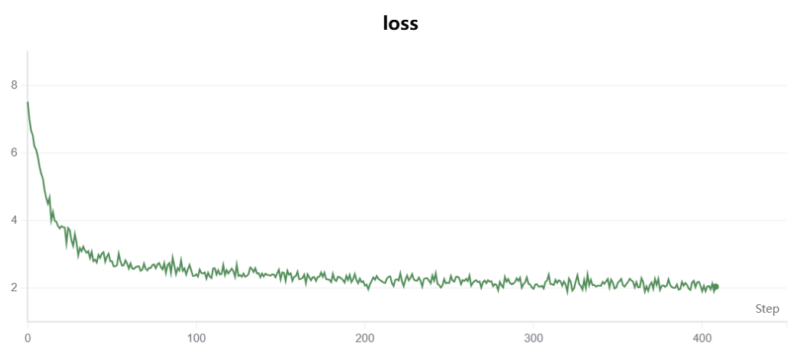
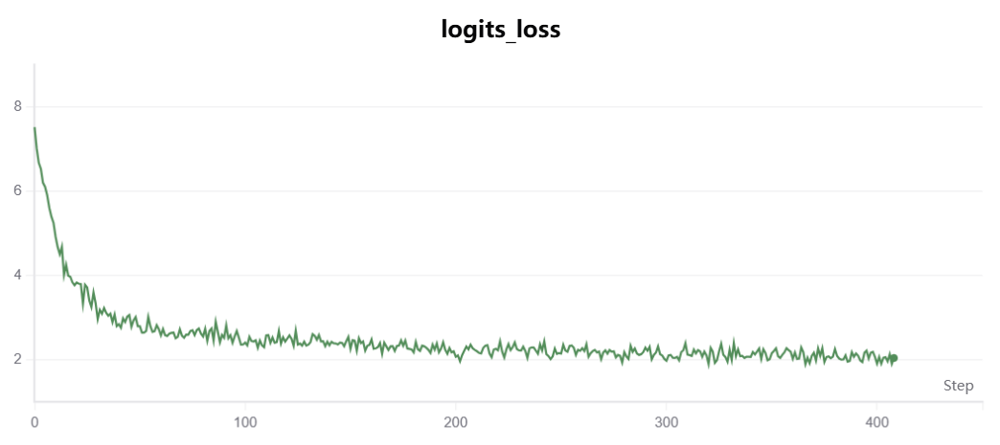
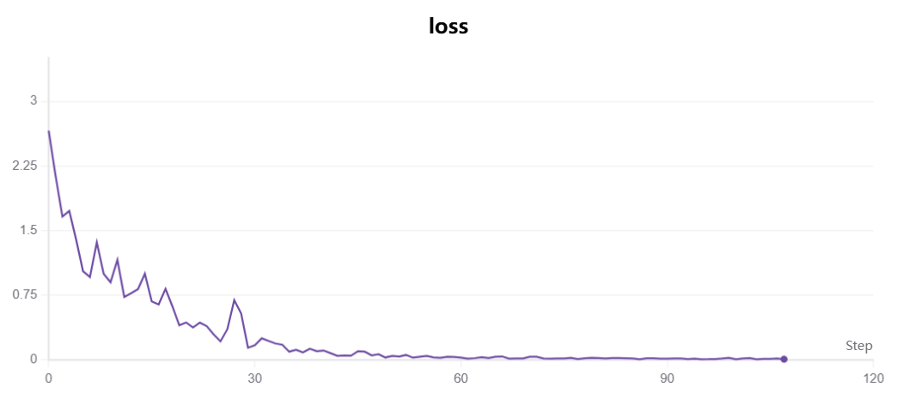
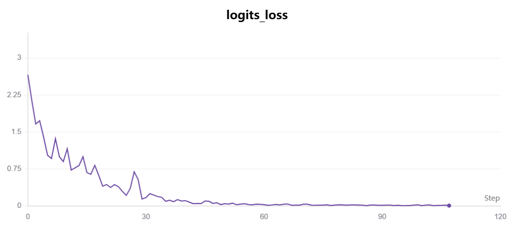
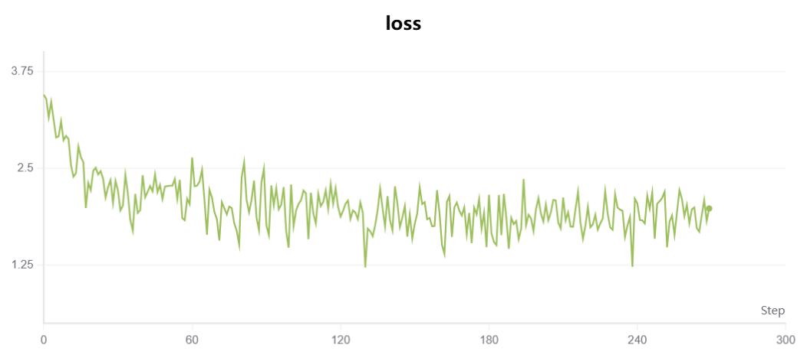
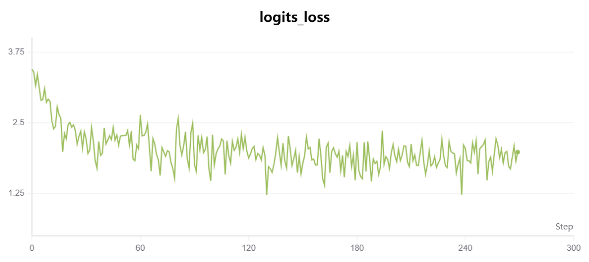

# MiniMind 大模型训练与微调实验

<div align="center">


**人工智能综合课程设计 · 实验三 · 组号11**

</div>

---

## 项目概述

本项目复现了 MiniMind 模型的完整训练流程，包括**预训练（Pre-training）**、**全参数有监督微调（SFT）**和**低秩适配微调（LoRA）**三个阶段。实验使用《华中科技大学研究生手册》进行领域适配微调，并对比分析了不同训练策略的效果差异。

## 小组成员分工

| 姓名 | 负责内容 |
|------|----------|
| 庄尚文 | 数据集预处理与格式转换、模型评测、损失曲线分析 |
| 张煜豪 | 模型代码环境搭建、LoRA低秩适配微调实现与训练 |
| 廖玺 | 预训练脚本调试、SFT全参数微调、实验报告撰写 |

## 实验环境

| 类型 | 配置 |
|------|------|
| 硬件环境 | NVIDIA RTX 4080 GPU |
| 软件环境 | Python 3.10, PyTorch, transformers 4.57.6, SwanLab |

## 实验内容

| 阶段 | 描述 | epochs | 学习率 | 训练参数量 |
|------|------|--------|--------|-----------|
| 预训练（Pretrain） | 从零开始训练基础语言模型 | 2 | 5e-4 | 768M（全参数） |
| 全参数SFT | 更新所有模型权重 | 20 | 1e-5 | 768M（全参数） |
| LoRA微调 | 低秩适配，仅更新适配器参数 | 10 | 1e-4 | ~0.8M（0.1%） |

## 模型架构

| 配置项 | 值 |
|--------|-----|
| 隐藏层维度（hidden_size） | 768 |
| 注意力头数（num_heads） | 12 |
| 层数（num_hidden_layers） | 8 |
| 最大序列长度（max_seq_len） | 340 / 768 |
| 词表大小 | ~60000 |

## 训练结果

### 预训练损失曲线

| 总损失（Total Loss） | Logits损失 |
|:---:|:---:|
|  |  |

预训练阶段，模型从随机初始化的参数开始学习语言的通用表示。损失从高处快速下降，第1-2轮训练后趋于平稳。

### SFT全参数微调损失曲线

| 总损失（Total Loss） | Logits损失 |
|:---:|:---:|
|  |  |

全参数微调更新所有模型权重。观察发现20 epoch后损失仍持续下降，结合评测结果确认已出现**过拟合**现象。

### LoRA微调损失曲线

| 总损失（Total Loss） | Logits损失 |
|:---:|:---:|
|  |  |

LoRA仅保留0.8MB的适配器权重，参数量仅为全参数的 **0.1%**，同时保持了相对较好的泛化能力。

## 输出文件

| 文件 | 说明 | 大小 |
|------|------|------|
| `out/pretrain_768.pth` | 预训练模型权重 | ~137MB |
| `out/full_sft_768.pth` | SFT全参数微调权重 | ~137MB |
| `out/lora_graduate_768.pth` | LoRA微调权重 | ~0.8MB |

## 模型生成效果对比

### 通用问答

| 模型 | Q: 你好，请介绍一下你自己 | Q: 为什么天空是蓝色的？ |
|------|--------------------------|------------------------|
| 官方模型 | 优秀，通用AI助手回答 | 正常科普回答 |
| 自训练-Pretrain | 乱码/重复输出 | 编码错误 |
| 自训练-SFT | **过拟合**：回答研究生手册内容 | **过拟合**：回答违纪处分规定 |
| 自训练-LoRA | 泛化较好，有一定相关性 | 有内容但不够准确 |

### 专业知识问答（华中科技大学研究生手册）

| 模型 | Q: 博士培养规定第一条内容？ |
|------|---------------------------|
| 官方模型 | 编造10条通用内容（**幻觉严重**） |
| 自训练-SFT | **准确**引用具体条款 |
| 自训练-LoRA | 基本正确，但有少量偏差 |

## 关键发现

1. **官方模型**：通用问答优秀，但专业知识存在严重幻觉，编造不存在的规定条款

2. **SFT全参数微调**：
   - 专业知识问答最准确，能精确引用研究生手册条款
   - 但过拟合严重，通用问题也回答学生手册内容
   - 如问"为什么天空是蓝色的？"却回答违纪处分规定

3. **LoRA微调**：
   - 参数效率极高，仅0.1%参数量
   - 泛化能力相对较好，不会强行关联学生手册
   - 专业知识准确性略逊于SFT

4. **共同问题**：所有自训练模型都会在回答末尾添加固定后缀：
   > "具体办理和执行口径应以学校最新研究生手册、院系通知及相关部门解释为准"

## 总结

| 模型 | 通用问答 | 专业知识 | 备注 |
|------|---------|---------|------|
| 官方模型 | 优秀 | 幻觉严重 | 通用能力强但专业知识不可靠 |
| 自训练-Pretrain | 一般 | 差 | 基线模型，泛化能力弱 |
| 自训练-SFT | **过拟合** | **准确** | 全参数更新，专业知识准确但失去泛化 |
| 自训练-LoRA | 一般 | 一般 | 轻量化微调，泛化能力相对较好 |

## 项目结构

```
minimind-master/
├── model/                      # 模型定义
│   ├── model_minimind.py       # MiniMind核心架构
│   ├── model_lora.py           # LoRA适配器
│   └── tokenizer.json          # 分词器
├── trainer/                    # 训练脚本
│   ├── train_pretrain.py       # 预训练
│   ├── train_full_sft.py       # 全参数SFT
│   └── train_lora.py           # LoRA微调
├── dataset/                    # 数据集
│   ├── graduate_handbook_sft.jsonl        # SFT训练数据
│   ├── pretrain_t2t_mini.jsonl             # 预训练语料
│   └── sft_t2t_mini.jsonl                  # SFT语料
├── scripts/                     # 工具脚本
│   ├── eval_llm.py             # 模型评测
│   └── convert_model.py        # 格式转换
├── out/                         # 输出权重
│   ├── pretrain_768.pth
│   ├── full_sft_768.pth
│   └── lora_graduate_768.pth
└── minimind-3/                  # 官方模型（HF格式）
```

## 参考资料

- MiniMind官方仓库：https://github.com/jingyaogong/minimind
- 实验日期：2026年4月

---

**组号**：11 | **课程**：人工智能综合课程设计
